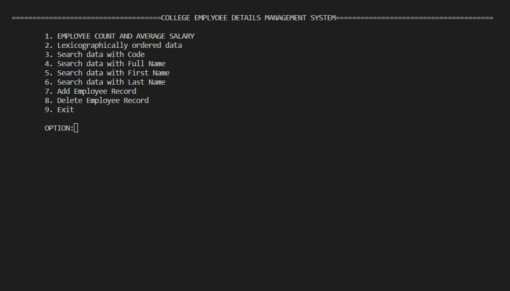
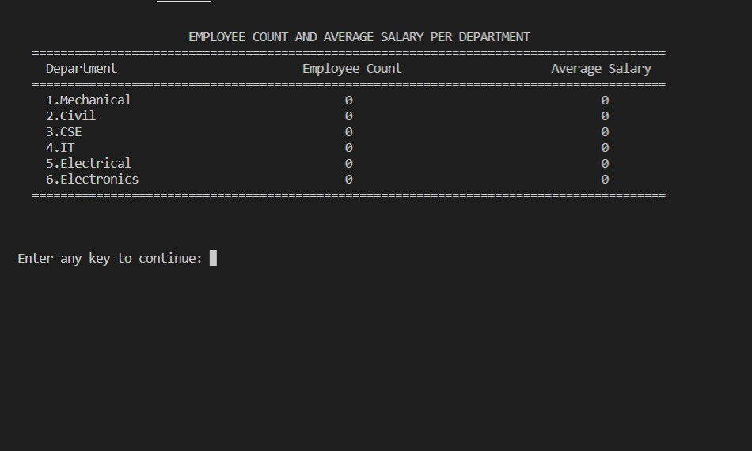
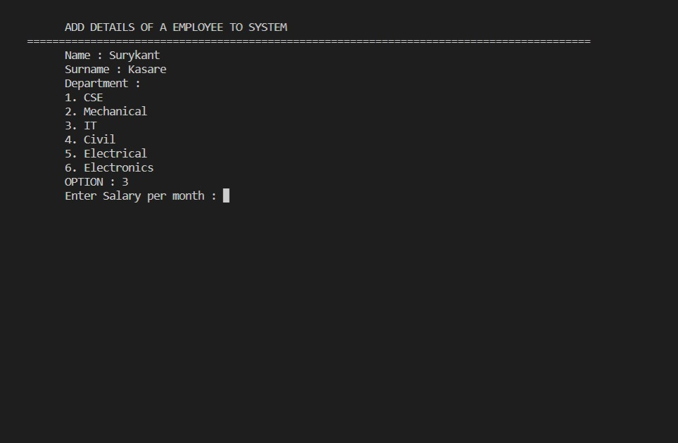

# FDMS
A Faculty Details Management System that keeps record of every Faculty and provides efficient searching.
Complete System providing features to insert,delete the record of a faculty of a particular branch.
Efficient Searching implemented with the help of TRIE Data Structure.
# Options

  

* Option :-
 Employee Count  

  

* Option :- Add Details of a Employee to system

  

